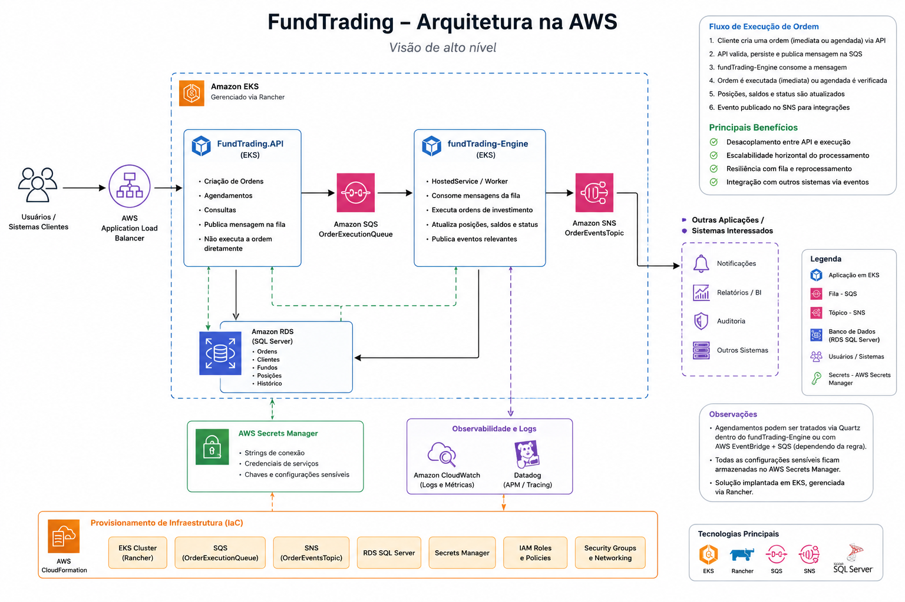
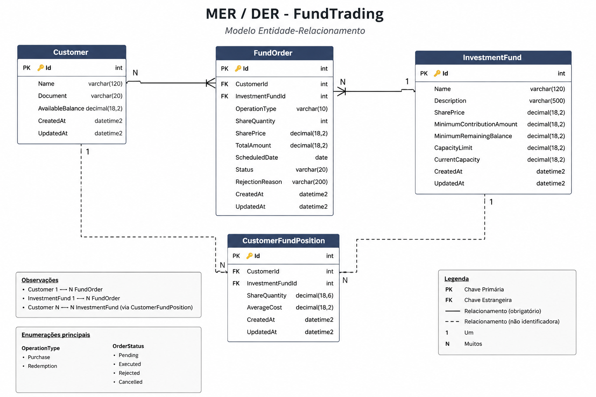

# Fund Trading API

## Sobre o projeto

O projeto Fund Trading API foi desenvolvido como solução para o case técnico proposto, com foco em:

* Arquitetura limpa e organizada
* Separação de responsabilidades
* Processamento síncrono e assíncrono de ordens
* Observabilidade e rastreabilidade
* Facilidade de manutenção e evolução
* Boas práticas de desenvolvimento backend com .NET

A aplicação permite o gerenciamento de:

* Clientes
* Fundos de investimento
* Ordens de aplicação e resgate
* Processamento agendado de ordens
* Controle de posição de cotas por cliente

---

# Arquitetura da solução

A solução foi dividida em camadas visando desacoplamento e organização.

```text
FundTrading.API
FundTrading.Application
FundTrading.Domain
FundTrading.Data
```

## FundTrading.API

Responsável por:

* Controllers
* Configuração da aplicação
* Middlewares
* Quartz Jobs
* Swagger
* Serilog
* Dependency Injection

## FundTrading.Application

Responsável por:

* Commands
* Command Handlers
* Orquestração dos casos de uso
* Regras de aplicação
* Jobs orchestration

Foi utilizado CQRS com MediatR.

## FundTrading.Domain

Responsável por:

* Entidades
* Enums
* Interfaces
* Regras de domínio
* Objetos base

## FundTrading.Data

Responsável por:

* Entity Framework Core
* DbContext
* Mapeamentos
* Repositórios
* Persistência de dados
* Unit Of Work

---

# Tecnologias utilizadas

* .NET 8
* ASP.NET Core
* Entity Framework Core
* SQL Server
* MediatR
* Quartz.NET
* Serilog
* Swagger
* xUnit
* Moq

---

# Padrões e decisões arquiteturais

## CQRS com MediatR

Foi utilizado CQRS para separar:

* Escrita de comandos
* Execução de regras de negócio

Os handlers são responsáveis por executar os casos de uso.

## Repository Pattern

Os repositórios abstraem o acesso aos dados e centralizam consultas e persistência.

## Unit Of Work

O DbContext implementa a interface `IUnitOfWork`, permitindo:

* Controle transacional
* Auditoria automática
* Persistência centralizada

## Auditoria automática

O sistema atualiza automaticamente:

* CreatedAt
* UpdatedAt
* CreatedBy
* UpdatedBy

Durante o `Commit()`.

## Processamento assíncrono

Foi utilizado Quartz.NET para processamento automático de ordens agendadas.

## Observabilidade

Foi implementado:

* Serilog
* CorrelationId
* Logging estruturado
* Middleware global de exceptions

---

# Fluxo principal da aplicação

## Criação de ordem

```text
Controller
    ↓
CreateFundOrderCommand
    ↓
CreateFundOrderCommandHandler
    ↓
Persistência da ordem
```

## Execução imediata

Ordens sem agendamento são executadas imediatamente:

```text
CreateFundOrderCommandHandler
    ↓
ExecuteFundOrderCommand
    ↓
ExecuteFundOrderCommandHandler
```

## Execução agendada

Ordens futuras:

```text
Quartz Job
    ↓
ProcessScheduledOrdersJob
    ↓
ExecuteFundOrderCommand
    ↓
ExecuteFundOrderCommandHandler
```

---

# Regras implementadas

## Aplicação

* Validação de saldo
* Validação de capacidade do fundo
* Validação de valor mínimo
* Atualização de posição do cliente

## Resgate

* Validação de posição de cotas
* Atualização da posição
* Crédito em saldo

## Agendamento

* Não permite datas passadas
* Não permite data atual
* Não permite finais de semana

## Fundos

* Fundo deve estar aberto para operação

---

# Logging

Foi utilizado Serilog para centralização dos logs.

Os logs possuem:

* CorrelationId
* Logs estruturados
* Persistência em arquivo
* Preparação para integração com Teams

---

# Quartz.NET

O Quartz é responsável pelo processamento automático de ordens agendadas.

Configuração:

* Segunda a sexta-feira
* 09:00
* Timezone São Paulo

---

# Como executar o projeto

## Pré-requisitos

* .NET 8 SDK
* SQL Server
* Visual Studio 2022 ou Rider

---

# Configuração do banco

A connection string deve ser configurada em:

```text
appsettings.Development.json
```

Exemplo:

```json
{
  "ConnectionStrings": {
    "DefaultConnection": "Server=localhost;Database=FundTrading;Trusted_Connection=True;TrustServerCertificate=True"
  }
}
```

---

# Executar migrations

```bash
dotnet ef database update
```

---

# Executar aplicação

```bash
dotnet run
```

---

# Swagger

Ao executar a aplicação:

```text
https://localhost:{porta}/swagger
```

---

# Testes unitários

Os testes unitários foram implementados utilizando:

* xUnit
* Moq

Principais cenários cobertos:

* Aplicação com saldo suficiente
* Aplicação sem saldo
* Resgate com posição válida
* Resgate sem posição
* Rejeição de ordens
* Execução de ordens

---

# Melhorias futuras

Possíveis evoluções:

* Retry policies com Polly
* Cache distribuído
* Event Bus
* Docker
* Kubernetes
* Health Checks
* Testes de integração
* Autenticação/autorização

---

# Desenho de Solução na Nuvem



# DER / MER



# Uso de IA no Projeto

Durante o desenvolvimento do projeto, utilizei IA como ferramenta de apoio técnico e aceleração de desenvolvimento, principalmente para:

* Estruturação inicial da arquitetura da solução
* Discussões sobre boas práticas
* Revisão de decisões arquiteturais
* Geração inicial de código boilerplate
* Apoio na criação de testes unitários
* Sugestões de organização de projeto e nomenclaturas
* Apoio na documentação técnica e README
* Discussões sobre observabilidade, logging e resiliência
* Auxílio na modelagem da arquitetura cloud e desenho da solução

A principal ferramenta utilizada foi o ChatGPT, atuando como um copiloto técnico para acelerar implementações repetitivas e permitir maior foco nas decisões arquiteturais e regras de negócio.

Apesar do apoio da IA, toda a modelagem da solução, validação das regras de negócio, revisão do código, ajustes arquiteturais e decisões técnicas foram conduzidas manualmente, incluindo:

* Estruturação das camadas da aplicação
* Definição do fluxo de processamento de ordens
* Uso de CQRS/MediatR
* Estratégia de processamento assíncrono
* Observabilidade com Serilog e CorrelationId
* Ajustes e correções durante integração e testes

A IA foi utilizada como ferramenta de produtividade e apoio técnico.


# Considerações finais

A solução foi construída buscando equilíbrio entre:

* Simplicidade
* Organização
* Escalabilidade
* Clareza de código
* Boas práticas

O objetivo foi entregar uma solução pragmática, mas preparada para evolução futura em ambiente corporativo.
